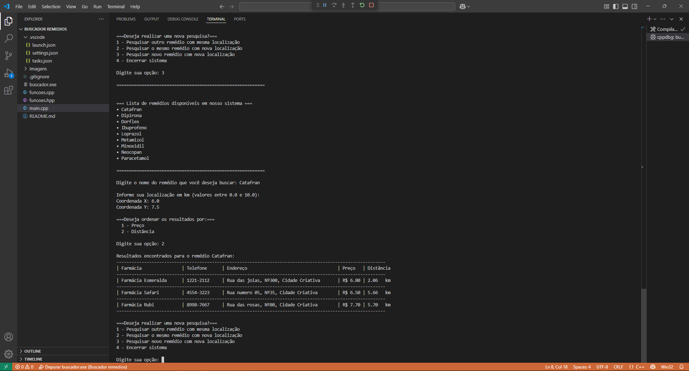

# Sistema de Busca de Remédios

Este projeto em C++ simula um sistema de busca de remédios que oferece a opção de ordenar por 
**preço** e **proximidade** nas farmácias que obtém o remédio buscado pelo usuário.

---

## Funcionalidades

- Busca de medicamentos por nome.
- Ordenação dos resultados por **menor preço** ou **menor distância**.
- Validação de entradas do usuário (nome do remédio e localização do usuário).
- Interface de terminal simples e amigável.
- Possibilidade de **reutilizar o sistema** com diferentes pesquisas com dados reutilizáveis.

---

## Simulação do Ambiente

- A cidade simulada tem **10 km x 10 km**.
- O usuário informa sua localização atual (x, y) onde o números da coordenada deve ser entre 0 e 10.
- A distância até cada farmácia é calculada em **linha reta**.
- Os dados das farmácias e remédios são cadastrados manualmente, e já tem pre cadastrados três farmácias e nove remédios.

---

## Tecnologias e Recursos Usados

- **Linguagem:** C++
- **Bibliotecas Padrão:**
  - `iostream`, `vector`, `string`, `unordered_map`, `cmath`, `iomanip`, `algorithm`, `limits`
- **IDE Recomendada:** Visual Studio Code com MSYS2 e configurações de `tasks.json` e `launch.json`

---

## Exemplo de Uso

- Oferece boas vindas ao usuário e imprime uma lista com os remédios disponíveis no sistema para buscas.

- Aqui o usuário escolhe algum remédio que esteja interessado conforme a lista imprimida, mesmo se o usuário escrever com letras minúsculas ou maiúsculas diferente de como está na lista, o sistema irá reconhecer o nome do remédio cadastrado no sistema.

- Sistema solicita a entrada do usuário para ter sua localização e futuramente obter a distância comparado as farmácias para conseguir ordenar os resultados.
- Caso as entradas sejam diferentes de 0 até 10, o sistema ira pedir novamente a coordenada até ser uma entrada válida

- O sistema imprime os resultados em formato de tabela e na ordenção escolhida pelo usuário

- Caso o usuário escolha alguma opção que necessite colocar novamente o nome do remédio, o sistema imprime a lista dos remédios cadastrados no sistema novamente

- Nem todos os remédios estão disponíveis em todas as farmácias! E o sistema consegue encontrar as farmácias exatas que obtém o remédio perfeitamente

- Aqui já foi escolhido uma opção que necessita de nova coordenadas e nova busca pelo remédio, o sistema substitui os dados e imprime os resultados conforme ordenação solicitada pelo usuário

- Tela de encerramento do sistema após escolher a opção 4.
